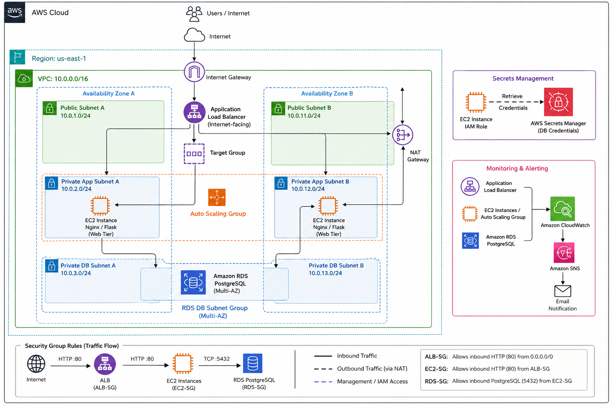

# aws-high-availability-web-app
Highly available AWS web application using ALB, Auto Scaling, EC2, RDS PostgreSQL, Secrets Manager, and CloudWatch.
## Project Overview

I designed and deployed a highly available three tier web application architecture on AWS within a custom VPC spanning two Availability Zones. The architecture separates public facing, application, and database resources across public and private subnets to improve security, availability, and fault tolerance.

An internet facing ALB distributes HTTP traffic to EC2 instances running in private application subnets. The application tier is managed by an ASG using a custom Launch Template. User Data automatically bootstraps new instances by installing Nginx and Python dependencies, deploying a Flask application, configuring systemd, and starting the required services.

The application connects to a PostgreSQL database hosted on Amazon RDS in dedicated private database subnets. Security groups restrict communication between tiers so that EC2 instances accept application traffic from the ALB security group, while RDS accepts PostgreSQL traffic only from the application tier's security group.

Public subnets use an Internet Gateway for internet connectivity, while private application subnets use a NAT Gateway for outbound internet access without directly exposing the EC2 instances to inbound internet traffic.

The architecture also uses load balancer health checks and Auto Scaling to detect and replace unhealthy application instances, providing automated recovery and maintaining application availability.

Database credentials are stored in AWS Secrets Manager rather than being hardcoded into the application or EC2 User Data. The Flask application uses the EC2 instance's IAM role to retrieve the required database credentials at runtime, allowing application instances to access RDS without storing long-lived credentials in the application configuration.

Amazon CloudWatch provides monitoring for the environment, with alarms configured for unhealthy application targets and high CPU utilization across key resources. Amazon SNS delivers notifications when alarm conditions are reached. This complements the architecture's automated recovery mechanisms by providing visibility into infrastructure and application health even when the ASG is able to replace unhealthy instances automatically.
## Architecture

## AWS Services Used
| Service | Purpose |
|---|---|
| Amazon VPC | Provides the isolated network environment for the architecture |
| Amazon EC2 | Hosts the Nginx web server and Flask application |
| Application Load Balancer  | Distributes incoming HTTP traffic across healthy EC2 instances |
| EC2 Auto Scaling | Maintains application capacity and replaces unhealthy instances |
| Launch Templates | Defines the configuration used to launch EC2 instances |
| Amazon RDS for PostgreSQL | Provides the managed relational database for the application |
| AWS Secrets Manager | Stores database credentials securely for runtime retrieval |
| AWS IAM | Allows EC2 instances to retrieve database credentials without hardcoded AWS credentials |
| NAT Gateway | Provides outbound internet access for EC2 instances in private subnets |
| Internet Gateway | Provides internet connectivity for resources in public subnets |
| Amazon CloudWatch | Monitors infrastructure health and resource utilization |
| Amazon SNS | Sends notifications when CloudWatch alarms enter an alarm state |
## Network Design

The architecture is deployed within a custom VPC using the `10.0.0.0/16` CIDR range. I selected a /16 network to provide sufficient address space for the current architecture while leaving room to create additional subnets and resources as the environment grows.

The VPC is divided into public, private application, and private database subnets across two Availability Zones. The public subnets contain internet facing resources such as the Application Load Balancer and NAT Gateway, while EC2 application instances are deployed within private subnets to prevent direct exposure to the public internet.

Public subnet route tables contain a default route (`0.0.0.0/0`) to the Internet Gateway. Private application subnet route tables instead direct outbound internet traffic (`0.0.0.0/0`) to the NAT Gateway. This allows private EC2 instances to initiate outbound connections, such as downloading software packages, without requiring direct inbound internet connectivity.

Resources are distributed across two Availability Zones to improve availability and fault tolerance. If an application instance or Availability Zone becomes unavailable, the Application Load Balancer can continue directing traffic to healthy application instances in the remaining Availability Zone while the Auto Scaling Group maintains the desired application capacity.
## Security Design

Security groups are used to restrict communication between each tier of the architecture following a least privilege approach.

The Application Load Balancer security group allows inbound HTTP traffic on port 80 from the public internet. The ALB acts as the public entry point for the application, while its listener and target group route requests to healthy application instances.

The EC2 application security group allows inbound HTTP traffic on port 80 only from the ALB security group. This prevents the application instances from directly accepting HTTP traffic from the public internet while still allowing the ALB to communicate with them.

The RDS security group allows inbound PostgreSQL traffic on port 5432 only from the EC2 application security group. This restricts database connectivity to the application tier rather than exposing the database directly to external clients.

Database credentials are stored in AWS Secrets Manager rather than being hardcoded into the application or User Data. EC2 instances use an IAM role with permission to retrieve the required secret at runtime, allowing the Flask application to authenticate to PostgreSQL without storing long-lived credentials directly in the application configuration.
## Application Architecture

Incoming HTTP requests first reach the internet facing Application Load Balancer, which forwards traffic to healthy EC2 instances in the Auto Scaling Group.

Each EC2 instance runs Nginx on port 80. Nginx acts as a reverse proxy, forwarding incoming requests to the Flask application running locally on port 8080.

The Flask application contains the application logic. When the root route (`/`) is requested, the application uses the AWS SDK for Python (`boto3`) to retrieve the database credentials from AWS Secrets Manager. The EC2 instance authenticates to AWS using its attached IAM role, so AWS credentials are stored on the instance.

After retrieving the database credentials, the Flask application uses a PostgreSQL client library to connect to the Amazon RDS PostgreSQL database over port 5432. The application runs a SQL query against the `users` table, retrieves the results, and generates an HTML response containing the database backed content.

The response then travels back through Nginx and the Application Load Balancer to the user.

### Request Flow

1. Client sends an HTTP request to the ALB.
2. The ALB forwards the request to a healthy EC2 target.
3. Nginx receives the request on port 80.
4. Nginx reverse proxies the request to Flask on `127.0.0.1:8080`.
5. Flask uses `boto3` and the EC2 IAM role to retrieve database credentials from Secrets Manager.
6. Flask connects to PostgreSQL on Amazon RDS over TCP port 5432.
7. PostgreSQL executes the requested SQL query and returns the data.
8. Flask generates the HTML response.
9. Nginx returns the response through the ALB to the client.
## High Availability and Auto Scaling

The application tier is deployed across two Availability Zones to improve fault tolerance and availability. The Application Load Balancer distributes traffic across healthy EC2 instances in both Availability Zones.

If an EC2 instance becomes unhealthy, the ALB stops routing traffic to that target and continues sending requests to the remaining healthy instances. This allows the application to remain available while the failed capacity is being replaced.

The EC2 instances are managed by an Auto Scaling Group using a custom Launch Template. The ASG maintains the configured desired capacity and automatically launches replacement instances when unhealthy instances are terminated.

When scaling policies are configured, the ASG can also increase or decrease the number of EC2 instances based on workload demand while staying within the configured minimum and maximum capacity limits.

New instances are automatically bootstrapped through Launch Template User Data, allowing replacement capacity to install and configure the application without manual intervention.
## Database Architecture

The application uses Amazon RDS for PostgreSQL as its relational database. RDS is deployed within dedicated private database subnets and is not publicly accessible, preventing direct database connections from the public internet.

A DB subnet group containing private database subnets across two Availability Zones provides RDS with eligible network locations for database deployment and supports AWS availability features that require multi-AZ subnet coverage.

Database access is restricted through the RDS security group. Inbound PostgreSQL traffic on TCP port 5432 is permitted only from the EC2 application security group. This allows the Flask application to communicate with the database while preventing direct access from the ALB or public internet.

The Flask application connects to RDS using the database endpoint rather than a fixed IP address. Database credentials are stored in AWS Secrets Manager and retrieved at runtime using `boto3`. The EC2 instances use an attached IAM role with permission to retrieve the required secret, eliminating the need to hardcode database credentials into the application or User Data.

When a request requires database information, Flask retrieves the credentials, establishes a connection to PostgreSQL, executes the SQL query, and uses the returned data to generate the application's response.
## Monitoring and Alerting

Amazon CloudWatch is used to monitor the health and performance of the application infrastructure. CloudWatch alarms were configured to detect unhealthy ALB targets and elevated CPU utilization across key compute and database resources.

Amazon SNS is integrated with the CloudWatch alarms to send email notifications when an alarm enters the `ALARM` state. This provides visibility into infrastructure problems even when automated recovery mechanisms are able to resolve them without manual intervention.

For example, if an application instance becomes unhealthy, the Application Load Balancer removes it from active traffic and the Auto Scaling Group can replace the failed capacity. CloudWatch and SNS ensure that the failure is still reported rather than being silently corrected by the self-healing architecture.

This monitoring layer provides both automated recovery and operational visibility into the environment.
## Automated EC2 Bootstrapping

EC2 instances are deployed through an Auto Scaling Group using a custom Launch Template. The Launch Template defines the configuration required for replacement and additional instances, including the AMI, instance type, security group, IAM instance profile, and User Data bootstrap script.

When a new instance launches, User Data automatically installs and configures the required application components, including Nginx, Python dependencies, and the Flask application. It also configures the application as a systemd service so that Flask starts automatically and can restart without requiring manual intervention.

This bootstrapping process allows the Auto Scaling Group to launch replacement instances with a consistent configuration. Rather than manually configuring each new EC2 instance, the infrastructure can automatically restore application capacity when an instance is replaced.

The IAM role defined through the Launch Template also allows newly launched instances to retrieve the required database credentials from AWS Secrets Manager at runtime.
## Testing and Validation

The architecture was tested by intentionally introducing failures and confirming that the environment recovered as expected.

- EC2 instances were manually terminated to verify that the Auto Scaling Group automatically launched replacement instances and restored the desired capacity.
- Application instances were taken out of service to confirm that the Application Load Balancer stopped routing traffic to unhealthy targets and continued serving requests through healthy instances in the other Availability Zone.
- RDS connectivity was validated through the Flask application by successfully retrieving and displaying PostgreSQL data on the website.
- Secrets Manager integration was validated by confirming that EC2 instances could retrieve database credentials through the attached IAM role rather than using hardcoded credentials.
- CloudWatch and SNS were tested by intentionally creating unhealthy application targets and verifying that alarm notifications were delivered.

These tests confirmed that the application could continue operating during individual instance failures while automated recovery mechanisms restored capacity.
## Challenges and Troubleshooting

Several configuration and deployment issues occurred while building the architecture. Troubleshooting these failures provided practical experience identifying problems across networking, IAM, load balancing, application deployment, and Auto Scaling.

### Application Load Balancer Security Group

The Application Load Balancer initially experienced connectivity issues because the correct ALB security group was not attached. This prevented the expected traffic flow between the load balancer and application instances.

I resolved the issue by verifying the ALB security group configuration and ensuring that the EC2 application security group allowed inbound HTTP traffic from the ALB security group.

### NAT Gateway and Private Subnet Connectivity

EC2 instances deployed into private subnets initially experienced outbound connectivity problems. Troubleshooting the route tables and NAT configuration revealed issues with the NAT Gateway configuration, including its Elastic IP association.

I corrected the NAT Gateway configuration and verified that the private route table directed `0.0.0.0/0` traffic to the NAT Gateway. This restored outbound internet connectivity for private application instances without making them publicly accessible.

### RDS Connectivity

Initial attempts to connect the application tier to PostgreSQL RDS resulted in connection timeouts. DNS resolution of the RDS endpoint worked successfully, which helped isolate the problem to network access rather than name resolution.

The RDS security group was updated to allow PostgreSQL traffic on TCP port 5432 from the EC2 application security group. Connectivity was then validated from an EC2 instance before testing database access through the Flask application.

### Launch Template IAM Role

One of the most significant deployment issues occurred after creating a new Launch Template version. The new version was unintentionally based on an older template version that did not include the required EC2 IAM instance profile.

As a result, the Auto Scaling Group successfully launched new instances and the application was deployed, but the Flask application could not retrieve database credentials from AWS Secrets Manager. Application logs revealed AWS credential-related errors.

After comparing the Launch Template configurations, I identified the missing IAM role, created a corrected Launch Template version, and rolled out new instances. The replacement instances were then able to retrieve the database secret successfully.

This demonstrated the importance of validating the complete configuration of a new Launch Template version rather than assuming settings from another version will automatically be preserved.

### Flask and systemd Port Conflict

While configuring the Flask application as a systemd service, the service repeatedly failed with an `Address already in use` error because another manually started Flask process was already using port 8080.

Using systemd logs and process/network troubleshooting commands helped identify the port conflict. After eliminating the conflicting process, the application could be managed automatically through systemd instead of requiring Flask to be started manually.

### Deployment and Monitoring Delays

During testing, some resources initially appeared unhealthy or incorrectly configured while AWS was still completing deployment, health checks, target registration, Auto Scaling replacement, or CloudWatch alarm evaluation.

This reinforced the importance of checking resource states, logs, metrics, and deployment progress before immediately modifying configurations. Allowing AWS services time to reach their expected state helped distinguish actual configuration failures from normal deployment delays.
## Key Takeaways
## Key Takeaways

This project helped me move beyond understanding individual AWS services and develop a better understanding of how they work together as part of a complete architecture.

- **Networking fundamentals:** I gained hands-on experience designing a VPC, subnetting across Availability Zones, configuring route tables, and understanding the different roles of Internet Gateways and NAT Gateways.

- **Traffic flow and security:** I developed a stronger understanding of how traffic moves through an AWS environment and how security group referencing can restrict communication between the ALB, application, and database tiers.

- **High availability and self-healing:** I learned how Application Load Balancers, health checks, Auto Scaling Groups, Launch Templates, and multiple Availability Zones work together to maintain application availability when individual instances fail.

- **Automated instance configuration:** Using Launch Templates and User Data demonstrated how EC2 instances can be automatically configured and deployed without manually rebuilding each server.

- **IAM and secrets management:** I learned how EC2 IAM roles and AWS Secrets Manager allow applications to securely access sensitive information without hardcoding credentials.

- **Application infrastructure:** Building the Nginx → Flask → PostgreSQL request path helped me understand how infrastructure and application components interact rather than viewing AWS services as isolated resources.

- **Monitoring and observability:** CloudWatch and SNS demonstrated the difference between automatically recovering from a failure and maintaining visibility into when and why failures occur.

- **Troubleshooting methodology:** One of my biggest takeaways was learning not to immediately assume that a resource is incorrectly configured when it does not respond as expected. AWS operations such as instance bootstrapping, target health checks, Auto Scaling replacement, and CloudWatch alarm evaluation can take time. I learned to verify logs, metrics, resource states, networking, and IAM permissions before making additional configuration changes.

Overall, this project strengthened my ability to design, deploy, troubleshoot, and explain a multi-tier AWS environment rather than simply configuring individual AWS services independently.
